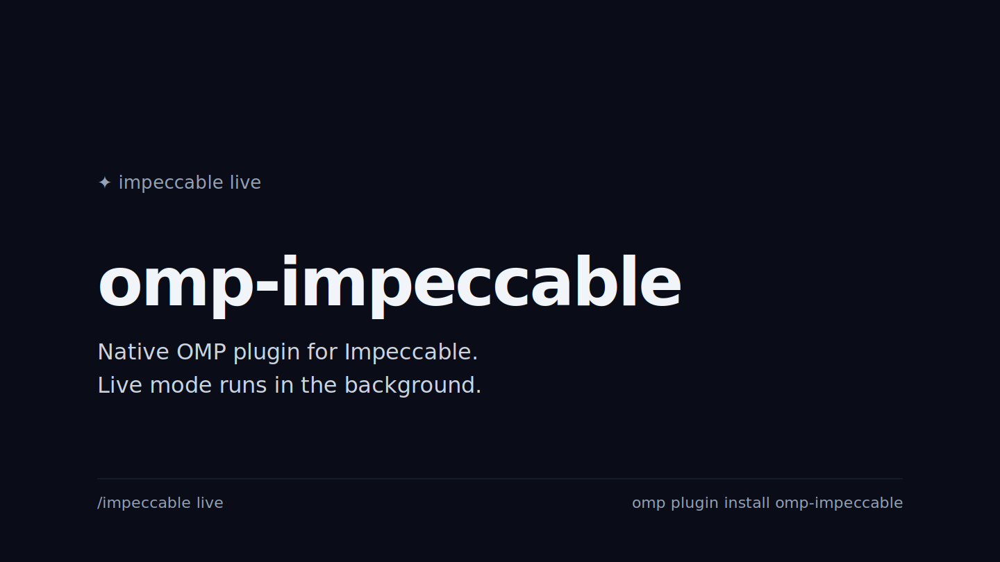

# omp-impeccable

Run Impeccable skills from OMP without blocking the agent.

<p align="center">
  
</p>

`omp-impeccable` is a native OMP plugin for the upstream [`impeccable`](https://github.com/pbakaus/impeccable) package. It installs or updates the Impeccable skill in your project, exposes `/impeccable` inside OMP, and runs Impeccable live mode in the background.

That means you can keep chatting with the agent while Impeccable watches the browser, queues design feedback, and asks OMP to respond. No long-running `live-poll.mjs` command holds the shell hostage.

## Why use this?

- **Native OMP plugin manifest** — package metadata uses `omp.extensions`, so `omp plugin install` loads it directly.
- **Non-blocking live mode** — `/impeccable live` starts the helper server and background poller, then immediately returns control to OMP.
- **Agent-native feedback loop** — browser events and Impeccable work arrive as hidden OMP extension messages.
- **Quiet status UI** — OMP shows a compact `impeccable live` status while the background bridge is running.
- **Upstream skill, no vendoring** — the plugin uses the official `impeccable` package to install/update the upstream Codex skill, relocates the managed copy to `.omp/skills/impeccable`, then publishes that skill path through OMP resource discovery.

## Install

```bash
omp plugin install omp-impeccable
```

Local testing from this checkout:

```bash
omp -e ./extensions/impeccable.ts
```

## Use

Install or update the upstream Impeccable skill:

```text
/impeccable install              # installs latest upstream skill into .omp/skills/impeccable
/impeccable update               # updates that skill from upstream
```

Run Impeccable skills from OMP. `omp-impeccable` exposes the skills in one command with arguments. Some example commands:

```text
/impeccable init
/impeccable shape new onboarding flow
/impeccable craft empty dashboard state
/impeccable audit src/pages/Home.tsx
/impeccable polish src/components/Header.tsx
```

Check [Impeccable docs](https://impeccable.style/docs/) to see the options. The upstream `pin`, `unpin`, and `hooks` commands are adapted for OMP:

```text
/impeccable pin audit       # creates a native /audit shortcut in .omp/commands/audit.md
/impeccable unpin audit     # removes that shortcut file
/impeccable hooks           # explains why upstream hook manifests are not installed for OMP
```

Pinned shortcuts are handled by the plugin when it is loaded. The `.omp/commands/*.md` file is also a native OMP fallback prompt, so the project still documents the shortcut.

Start the non-blocking live loop:

```text
/impeccable live
```

While live mode is running, OMP remains usable. Impeccable events are delivered in the background, and the agent can reply through `impeccable_live_reply` / `impeccable_live_complete` without exposing the polling loop as a foreground task.

Check or stop live mode:

```text
/impeccable live status
/impeccable live stop
/impeccable stop
```

You can also say `stop live` to stop it quietly.


## Attribution

This plugin is an OMP-native fork of [`pi-impeccable`](https://github.com/jordi9/pi-impeccable) by jordi9. The upstream Impeccable package and skill are created by [Paul Bakaus](https://github.com/pbakaus) and live at [`pbakaus/impeccable`](https://github.com/pbakaus/impeccable). This repository is only the OMP adapter; it does not vendor Impeccable.

## Release

Releases are tag-driven:

1. Bump `package.json`.
2. Update `CHANGELOG.md`.
3. Run release checks.
4. Push `main`, then create and push the matching Git tag.

```bash
pnpm release:check
git-cliff --unreleased --tag v0.1.0
git tag v0.1.0 main
git push origin main v0.1.0
```

## License

Apache-2.0, matching upstream Impeccable.
